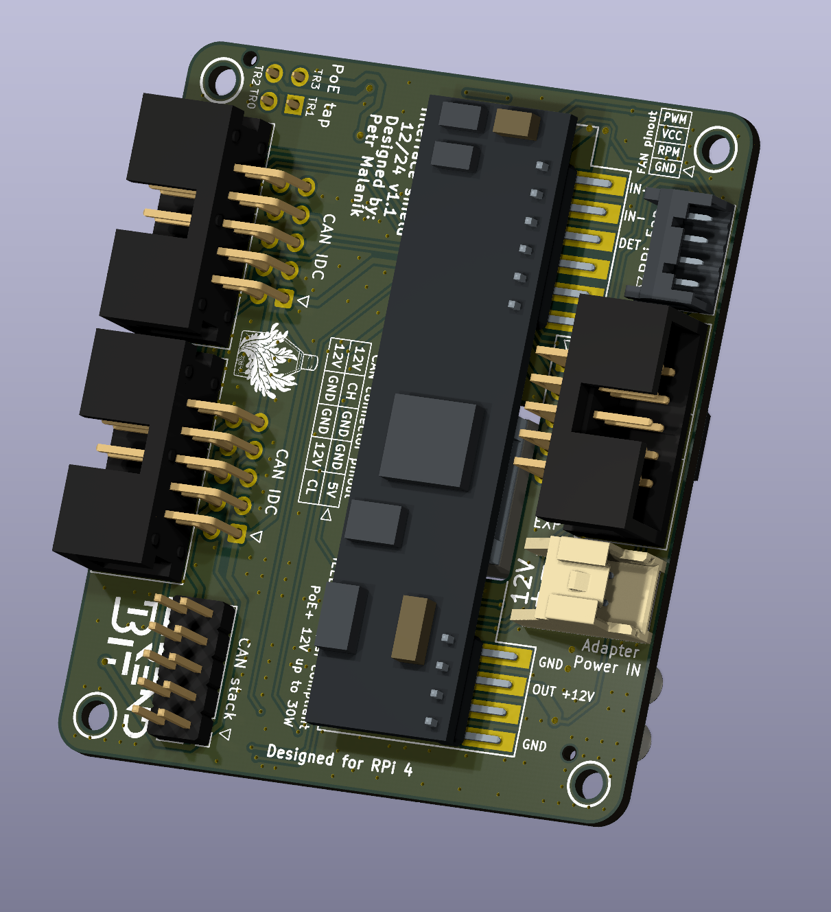
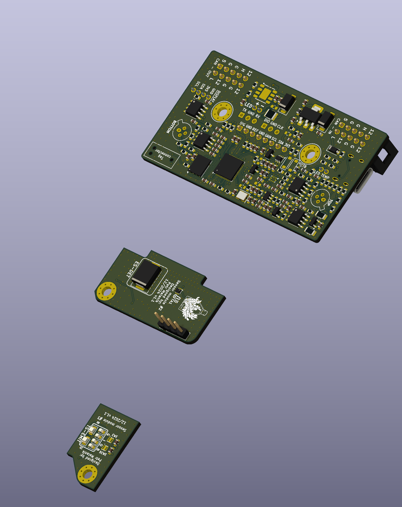
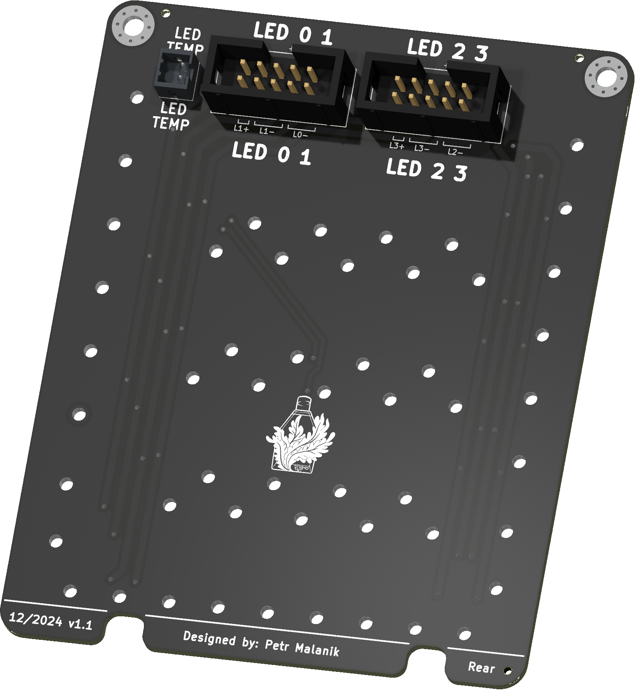
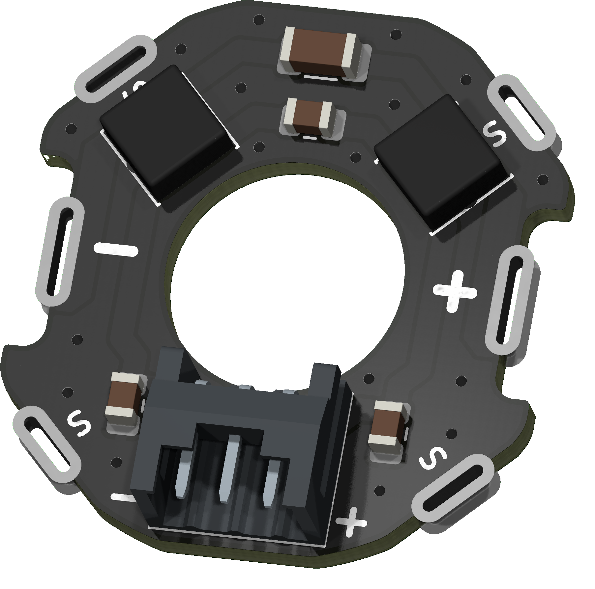
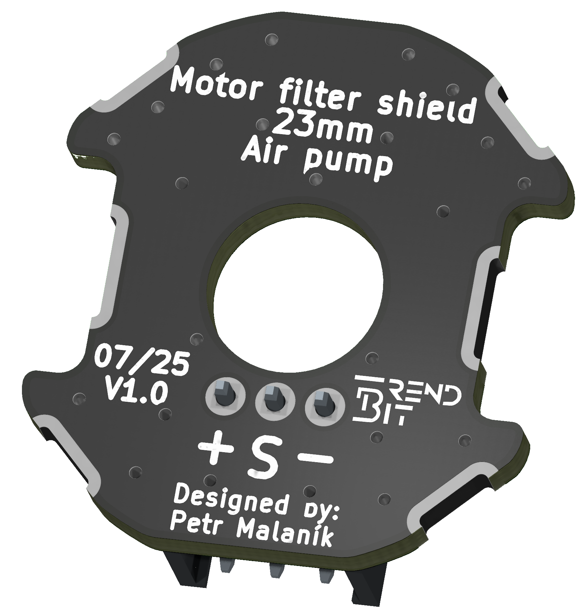
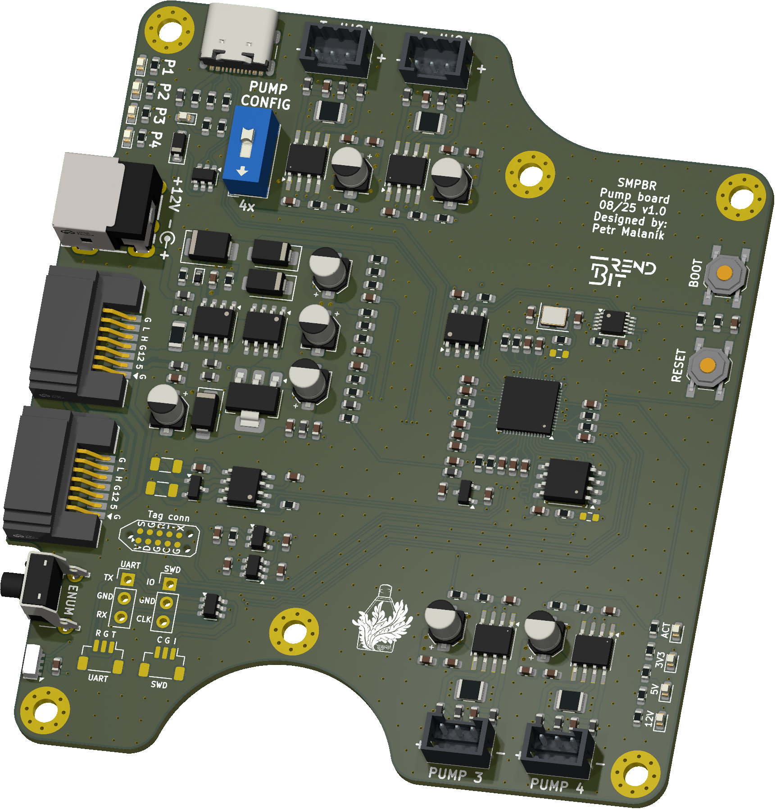
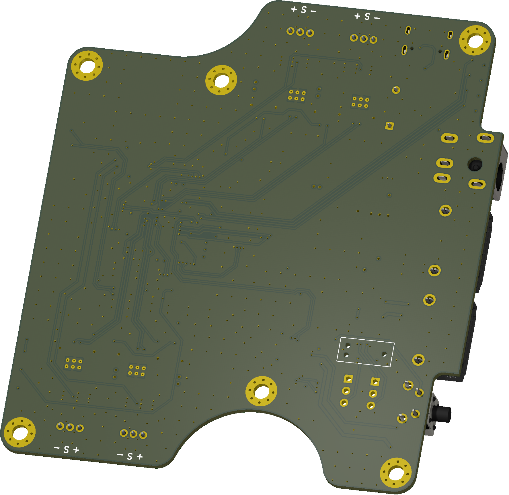

# SMBR - Hardware
This repository contains the documentation for all hardware modules that make up or can be connected to the Smart Modular BioReactor. All designs were made in KiCAD.

# General system design
All the main modules are built on a similar basis. These are the RP2040 microcontroller, CANBus and development resources (SWD, UART, etc). The individual modules, in turn, add components to this base that correspond to their specific application. For example, in the case of the Control board, this includes motor drivers or electronics that control and monitor fans. The modules communicate with each other via the CAN bus, where a custom protocol is used.

# Modules
### Interface board
Extension for RPi 4 which adds capabilities for communication and power inputs. Board serves as hub for CAN bus connection to other modules. Modules can be connected via 3 IDC cables or stacking connector on top. Board is connected to RPi via 40 pin connector. Via this connector is Rpi power and communicate with CAN bus transceiver via SPI. I2C can be used to read on board ADC which read board input voltage, current. This board also supplies 5V rail for Rpi and rest of the system. PoE module can be mounted to the board and PoE lines will be passed from RPi header.

  
&nbsp; &nbsp; &nbsp; &nbsp;
  

# Control board
Board responsible for main control function of SMPBR. Can be used to control illumination intensity. Drives peltier element which influence temperature of algae in bottle. Controls Aerator, Peristaltic pump, Mixer and heat control fans on device. Reads temperature of heater plate and LED panel. Can be used as additional CAN bus HUB. Is designed to be stacked on top of Interface module, as third layer of sandwich RPi-Interface-Control.

  
&nbsp; &nbsp; &nbsp; &nbsp;
  

### Sensor board
Module performing most of the basic measurements related to experiment. Consists of three boards which  can be connected together around sampling cuvette. Sample is pumped into cuvette and after adaptation the measurements can start. For OJIP measurement sample is saturated with high power 10W Green LED and resulting value is measured with adaptive gain IR energy sensor. Another measurement is optical density which can be measured at 6 defined wavelengths. Board also measures temperature in bottle via two contact-less thermometers (thermopiles).

  
&nbsp; &nbsp; &nbsp; &nbsp;
  

### Illumination board - Basic RGBW
SMPBR illumination panel with 4 channels. Channels can be controlled individually from control module. Each module has own power limit based on on board sense resistor. Board has integrated thermistor in order to limit heat dissipation which could influence the experiment.

This board has four basic colors:
- Red 625nm 4.8W
- Green 520nm 5.8W
- Blue 465nm 5.8W
- White (Warm) 2700K 6.1W

  
&nbsp; &nbsp; &nbsp; &nbsp;
  

### Motor filter shield for peristaltic pump
Small PCB directly soldered to motor terminals of Peristaltic pump motor. It acts as a low pass filter reducing EMI. However, it can also be soldered directly to the motor chassis, further improving EMC. It simplifies motor connection by allowing the motor to be connected via a connector on the board.

  
&nbsp; &nbsp; &nbsp; &nbsp;
  

### Motor filter shield for air pump
Small PCB directly soldered to motor terminals of air pump motor. It acts as a low pass filter reducing EMI. However, it can also be soldered directly to the motor chassis, further improving EMC. It simplifies motor connection by allowing the motor to be connected via a connector on the board.

  
&nbsp; &nbsp; &nbsp; &nbsp;
  

### [WIP] Pump board 
Board for expansion pump module, which is used to control additional peristaltic pumps. To this board up to 4 peristaltic pumps can be connected a controlled. Module can be connected to SMPBR reactor via expansion port. Multiple of those modules can be connected to one bio-reactor and can be chained bia expansion ports. Module also have external power, because when more modules will be connected to expansion port, main adapter can be overloaded. External power input is prioritized over power from extension cable.

  
&nbsp; &nbsp; &nbsp; &nbsp;
  

### Sata Expansion port

### Fluorometer LED
