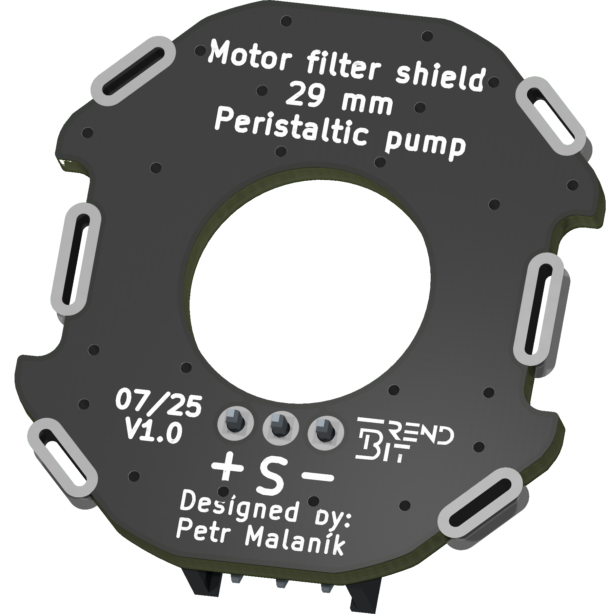

# SMBR - Hardware
This repository contains the documentation for all hardware modules that make up or can be connected to the Smart Modular BioReactor. All designs were made in KiCAD.

# General system design
All the main modules are built on a similar basis. These are the RP2040 microcontroller, CANBus and development resources (SWD, UART, etc). The individual modules, in turn, add components to this base that correspond to their specific application. For example, in the case of the Control board, this includes motor drivers or electronics that control and monitor fans. The modules communicate with each other via the CAN bus, where a custom protocol is used.

# Modules
### Interface board

### Control board

### Sensor board

### Illumination module RGBW

### Motor filter shield for peristaltic pump
Small PCB directly soldered to motor terminals of Peristaltic pump motor. It acts as a low pass filter reducing EMI. However, it can also be soldered directly to the motor chassis, further improving EMC. It simplifies motor connection by allowing the motor to be connected via a connector on the board.

  
&nbsp; &nbsp; &nbsp; &nbsp;
  

### Motor filter shield for air pump
Small PCB directly soldered to motor terminals of air pump motor. It acts as a low pass filter reducing EMI. However, it can also be soldered directly to the motor chassis, further improving EMC. It simplifies motor connection by allowing the motor to be connected via a connector on the board.

  
&nbsp; &nbsp; &nbsp; &nbsp;
  

