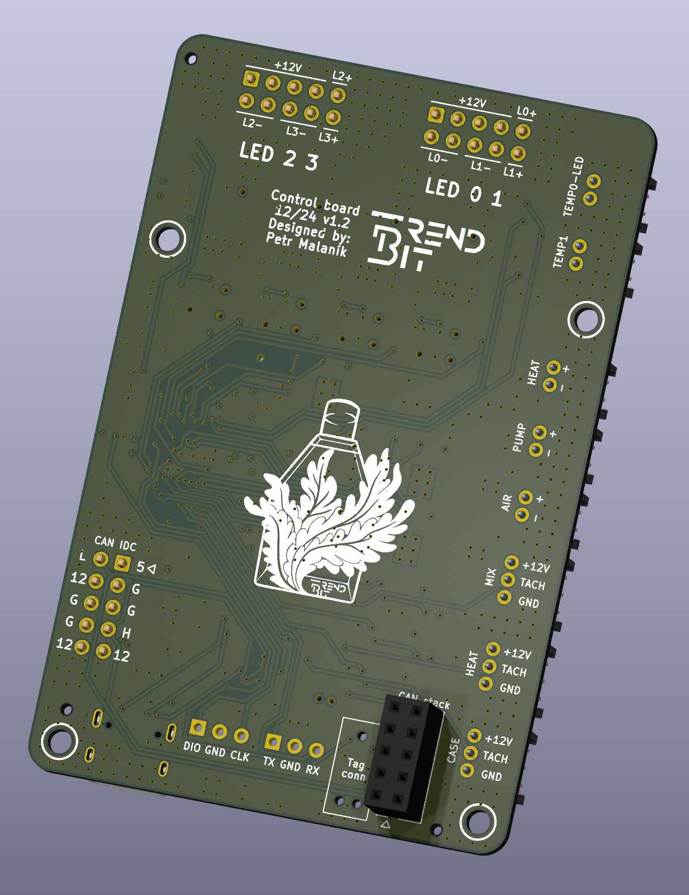

# Control board
Board responsible for main control function of SMPBR. Can be used to control illumination intensity. Drives peltier element which influence temperature of algae in bottle. Controls Aerator, Peristaltic pump, Mixer and heat control fans on device. Reads temperature of heater plate and LED panel. Can be used as additional CAN bus HUB. Is designed to be stacked on top of Interface module, as third layer of sandwich RPi-Interface-Control.

  
&nbsp; &nbsp; &nbsp; &nbsp;
  

## Manufacturing configuration
- Panel 2x2
- Thickness: 1.6mm
- Layers: 4
- Color: Green/White
- Surface: HASL Lead Free
- Confirm Production file: No
- Mark: Remove
- Assembly: Standard - Top Side
- Edge Rails/Fiducials: Added by Customer
- Confirm parts placement: Yes
