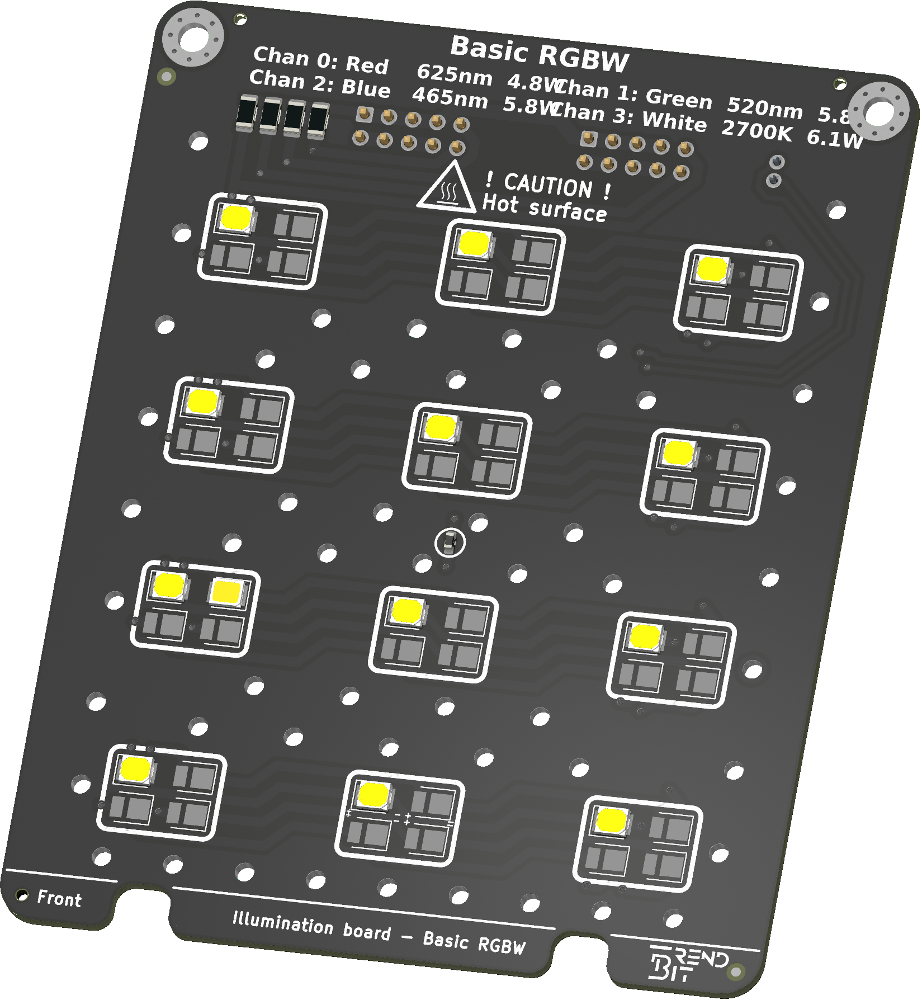
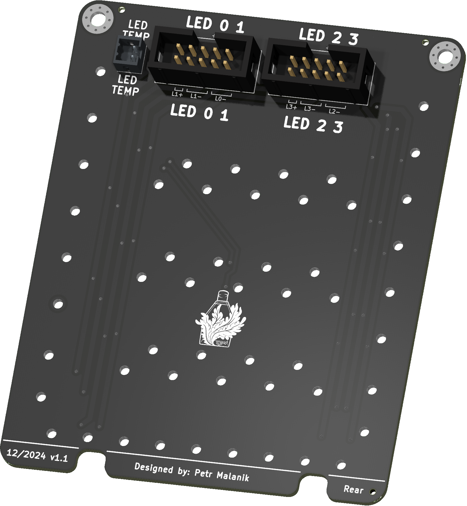

# Illumination board - Basic RGBW
SMPBR illumination panel with 4 channels. Channels can be controlled individually from control module. Each module has own power limit based on on board sense resistor. Board has integrated thermistor in order to limit heat dissipation which could influence the experiment.

This board has four basic colors:
- Red 625nm 4.8W
- Green 520nm 5.8W
- Blue 465nm 5.8W
- White (Warm) 2700K 6.1W

  
&nbsp; &nbsp; &nbsp; &nbsp;
  

## Manufacturing configuration
- Panel 2x2
- Thickness: 1.6mm
- Layers: 2
- Color: Black/White
- Surface: HASL Lead Free
- Confirm Production file: No
- Mark: Remove
- Assembly: Economic - Top Side
- Edge Rails/Fiducials: Added by Customer
- Confirm parts placement: Yes
