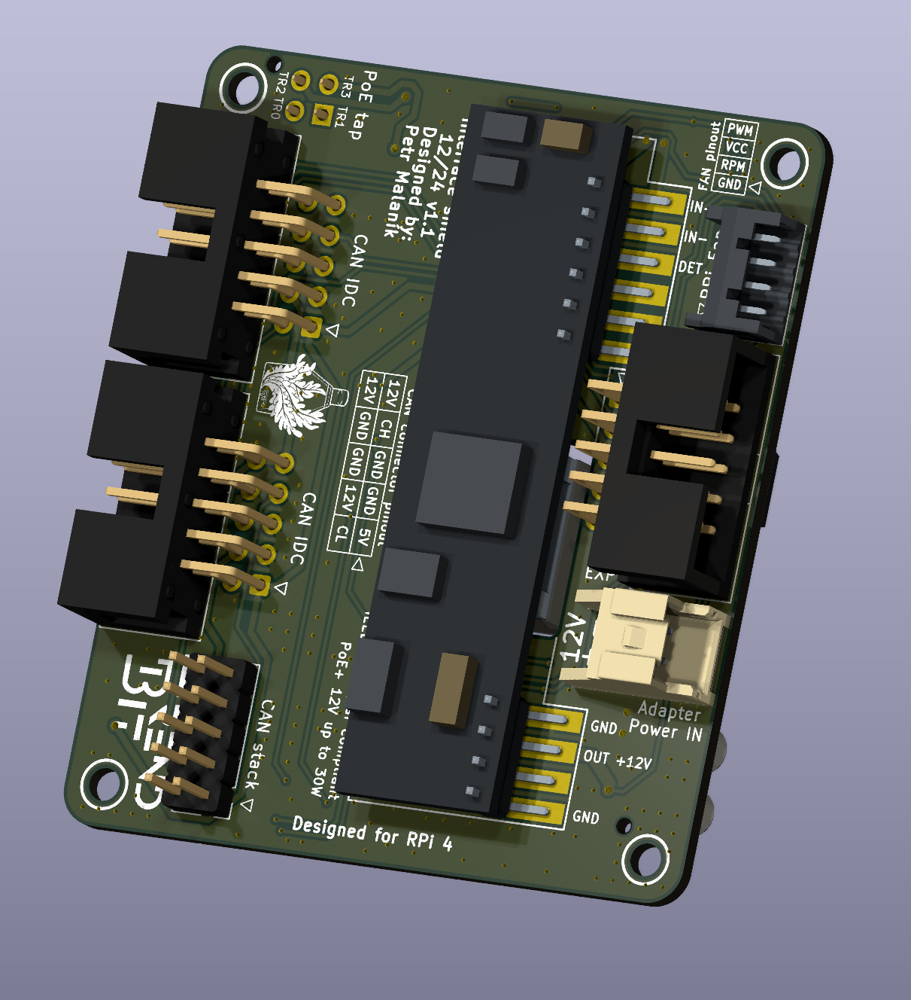
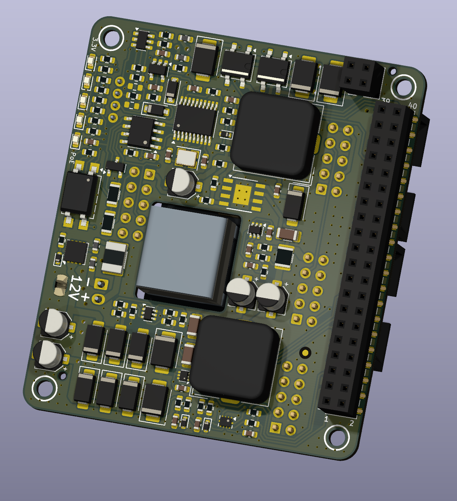

# Interface board
Extension for RPi 4 which adds capabilities for communication and power inputs. Board serves as hub for CAN bus connection to other modules. Modules can be connected via 3 IDC cables or stacking connector on top. Board is connected to RPi via 40 pin connector. Via this connector is Rpi power and communicate with CAN bus transceiver via SPI. I2C can be used to read on board ADC which read board input voltage, current. This board also supplies 5V rail for Rpi and rest of the system. PoE module can be mounted to the board and PoE lines will be passed from RPi header.

  
&nbsp; &nbsp; &nbsp; &nbsp;
  

## Manufacturing configuration
- Panel 2x2
- Thickness: 1.6mm
- Layers: 2
- Color: Green/White
- Surface: HASL Lead Free
- Confirm Production file: No
- Mark: Remove
- Assembly: Standard - Both Sides
- Edge Rails/Fiducials: Added by Customer
- Confirm parts placement: Yes
