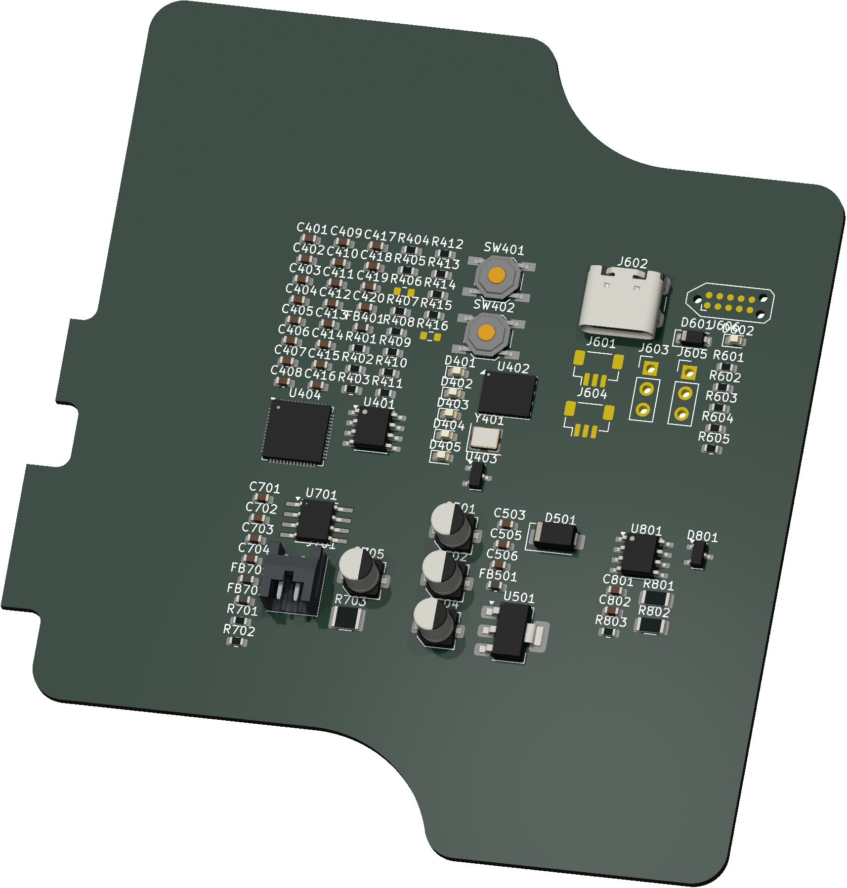
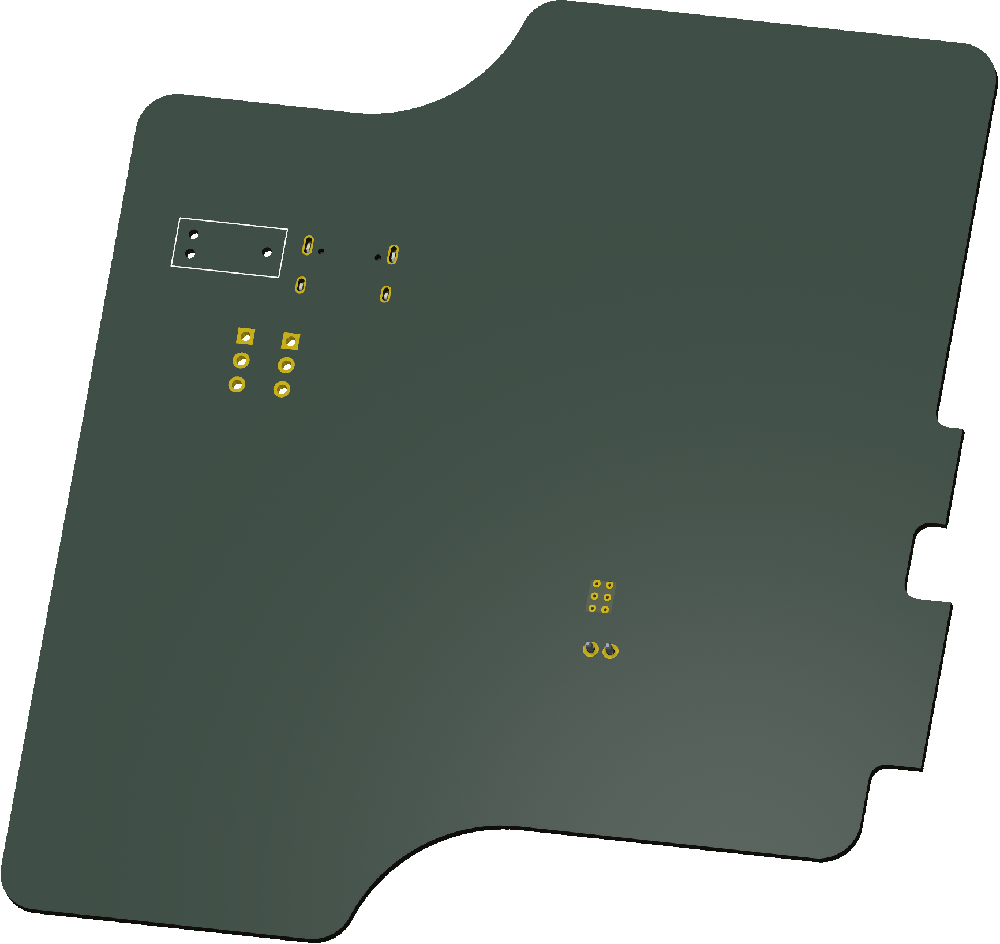

# Pump board
Board for expansion pump module, which is used to control additional peristaltic pumps. To this board up to 4 peristaltic pumps can be connected a controlled. Module can be connected to SMPBR reactor via expansion port. Multiple of those modules can be connected to one bio-reactor and can be chained bia expansion ports. Module also have external power, because when more modules will be connected to expansion port, main adapter can be overloaded. External power input is prioritized over power from extension cable.

  
&nbsp; &nbsp; &nbsp; &nbsp;
  

## Manufacturing configuration
- Single pieces
- Thickness: 1.6mm
- Layers: 4
- Color: Green/White
- Surface: HASL Lead Free
- Confirm Production file: No
- Mark: Remove
- Assembly: Economic - Top Side
- Edge Rails/Fiducials: Added by JLCPCB
- Confirm parts placement: Yes
