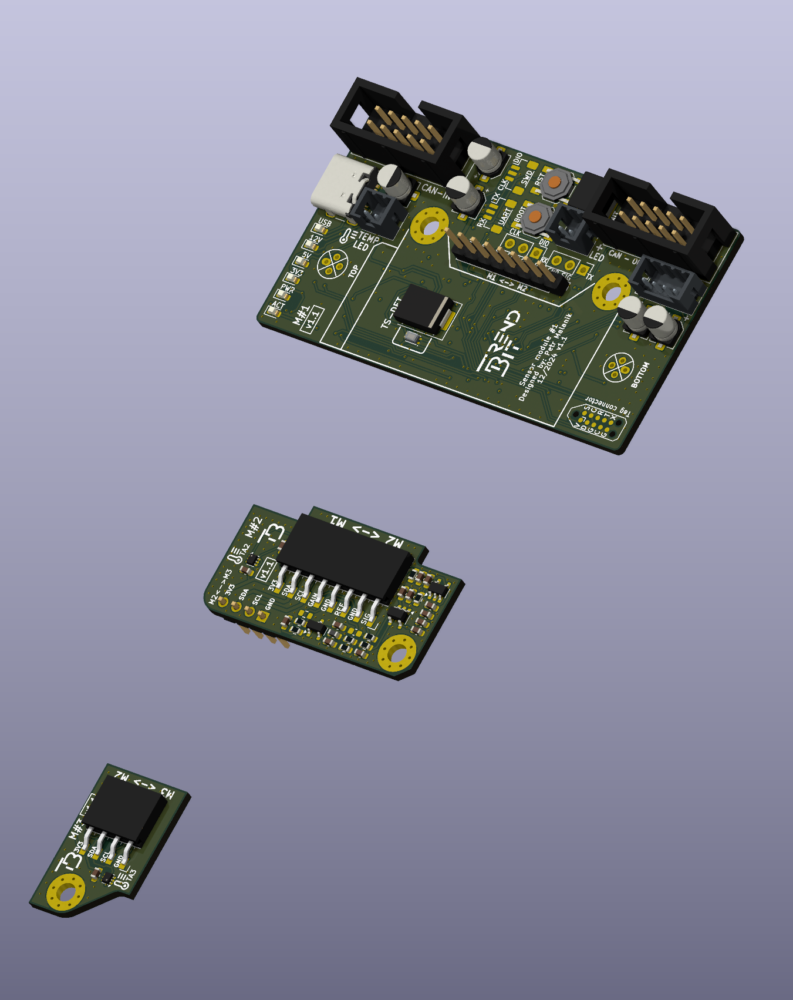
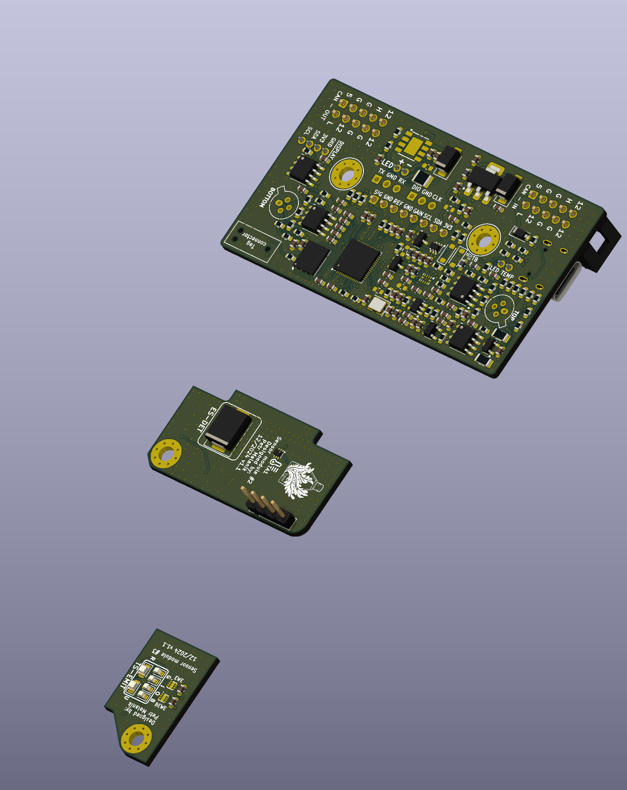

# Sensor board
Module performing most of the basic measurements related to experiment. Consists of three boards which  can be connected together around sampling cuvette. Sample is pumped into cuvette and after adaptation the measurements can start. For OJIP measurement sample is saturated with high power 10W Green LED and resulting value is measured with adaptive gain IR energy sensor. Another measurement is optical density which can be measured at 6 defined wavelengths. Board also measures temperature in bottle via two contact-less thermometers (thermopiles).

  
&nbsp; &nbsp; &nbsp; &nbsp;
  

## Manufacturing configuration
- Panel 1x3 - Individual boards
- Thickness: 1.6mm
- Layers: 4
- Color: Green/White
- Surface: HASL Lead Free
- Confirm Production file: No
- Mark: Remove
- Assembly: Standard - Both Sides
- Edge Rails/Fiducials: Added by Customer
- Confirm parts placement: Yes
